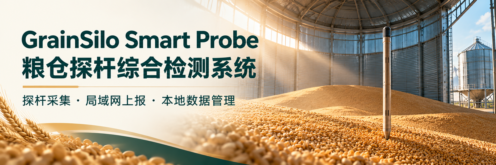
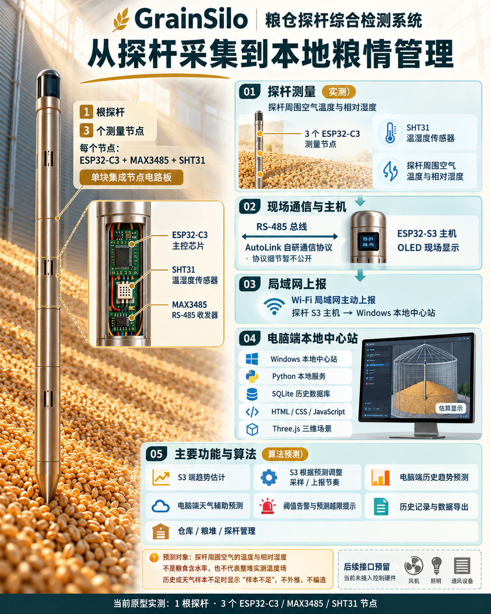
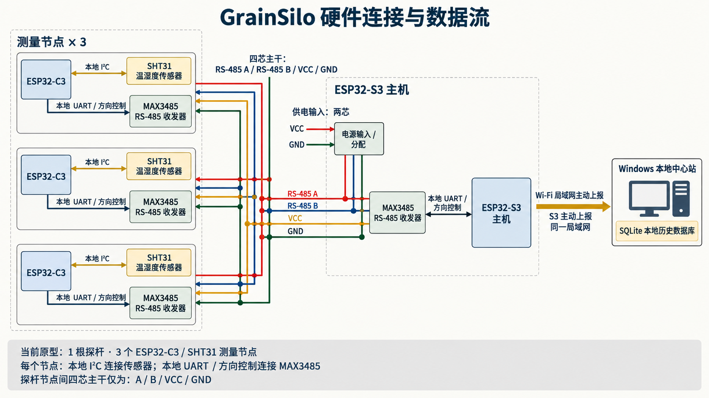
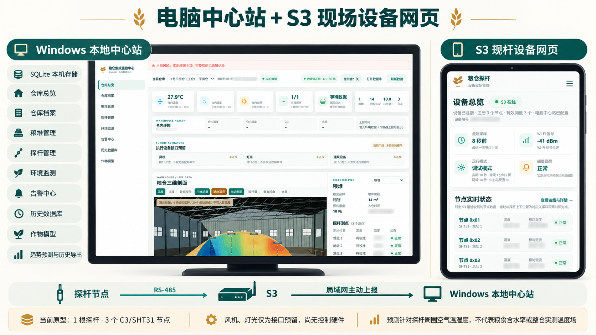
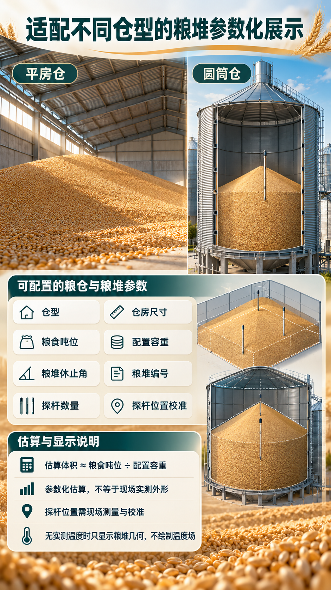
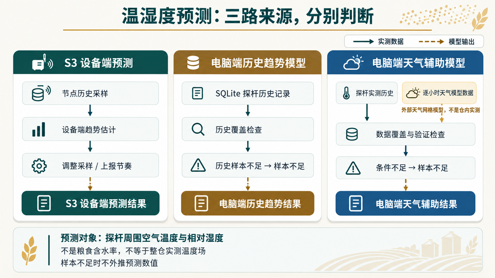

  

<h1 align="center">粮仓探杆综合检测系统</h1>

<strong>GrainSilo Smart Probe</strong>

模块化温湿度采集 · RS-485 汇总 · 局域网主动上报 · Windows 本地管理

> 本仓库公开 GrainSilo 项目源码与用户版电脑中心站。**AutoLink 自研协议暂不开源**；GrainSilo 软件采用定制非商业许可，并非 OSI 标准开源许可证。硬件接线资料按单独声明的范围采用 CC BY 4.0。

## 项目简介

GrainSilo 是一套面向教学、个人学习与非商业研究的粮仓温湿度监测原型。当前实物为 **1 根探杆、3 个 ESP32-C3 / MAX3485 / SHT31 测量节点和 1 个 ESP32-S3 主机**。每个测量节点的 C3、RS-485 收发器与温湿度传感器集成在同一块小电路板中，安装于长而光滑的探杆结构内；不是外挂方盒或三根独立探针。

节点测得的是探杆周围空气的温度和相对湿度（%RH），不是粮食含水率。S3 汇总节点数据后，通过 Wi-Fi 主动上报到同一可信局域网中的 Windows 本地中心站；电脑端使用本地 SQLite 保存历史记录。

## 项目结构与数据流

  

<em>点击示意图可查看原尺寸，便于阅读图中的模块与技术说明。</em>

上图用于解释系统模块和数据流，探杆外形及网页场景属于说明性视觉，不是经过尺寸验证的实物外壳、现场粮仓测绘或实时数据截图。

## 硬件连接

  

当前连接关系：两芯供电进入 S3 侧；S3 侧将供电与 RS-485 A/B 组成四芯主干，四芯为 **A、B、VCC、GND**，三个节点分别从主干分支。I²C 传感器线、节点 MCU 与本地收发器之间的 UART / 方向控制线都属于模块内部连接，不在四芯主干中。

完整接线原则、固件 GPIO 映射、供电核验和网络安全边界见[系统架构与硬件连接](docs/系统架构与硬件连接.md)。接线图适合快速理解结构，不能替代核对实物板卡丝印、电源能力及现场布线。

## 两个网页

  

上图展示项目中的真实网页界面。图片中的状态和读数只作为页面展示内容，不是随仓库发布的数据库、论文记录或当前在线状态。

- **Windows 本地中心站网页**：由桌面程序启动，管理仓库档案、粮堆、探杆、环境、告警与历史记录；提供趋势/天气辅助预测及数据导出。数据保存在本机 SQLite。风机、灯光和通风目前只是接口预留，不会控制真实设备。
- **S3 探杆设备网页**：首次配置时可连接探杆自带的 GrainSilo 配网热点，设置家庭 Wi-Fi 和电脑中心站地址；加入家庭网络后，可通过探杆的局域网 IP 打开设备网页，查看节点数据并配置设备参数。设备网页通过 HTTP 提供，当前没有登录认证。

电脑端是接收方，探杆 S3 是主动上报方；电脑端不会扫描或寻找探杆。两者需位于可互通的同一可信局域网。

## 仓房与粮堆参数化展示

  

软件按仓型和用户输入的尺寸、吨位、容重等参数估算几何与体积，用于直观展示和配置核对。参数化模型不是现场测绘结果；估算粮堆体积不等于实测外形。探杆物理位置须现场校准，不能根据 AutoLink 通信地址推断节点的上、中、下位置。

## 温湿度预测与告警

  

预测对象是探杆周围空气的温度与相对湿度。S3 设备端预测、电脑端历史趋势模型和电脑端天气辅助模型是分开的输出，各自按数据来源标注；样本不足时应显示“样本不足”，不生成确定性预测。它们不是粮食含水率预测，也不代表整堆实测温度场或 CFD 仿真。预测和告警仅供实验观察，不能单独作为粮食安全或通风决策依据。

## 下载并启动电脑端

[下载 Windows x64 便携版（ZIP）](releases/GrainSilo-Desktop-Windows-x64.zip)

1. 下载并解压整个 ZIP 文件夹。
2. 双击“粮仓集成监控中心.exe”。
3. 桌面程序启动本机服务并打开浏览器；保持程序运行，退出程序会停止中心站服务。

这是便携程序，不是独立原生浏览器内核应用；网页由本机服务提供。用户数据库和日志保存在 Windows 用户本地数据目录，不包含在源码仓库或 ZIP 中。源码包也随 ZIP 一并提供。更详细说明见[电脑端运行与数据说明](docs/电脑端运行与数据说明.md)。

## 固件与 AutoLink 边界

仓库内的 firmware 目录包含 GrainSilo 的 S3/C3 应用集成源码，但不含 AutoLink 协议库、协议实现或完整协议资料。因此电脑中心站可单独运行；**仅克隆本仓库不能独立编译 S3/C3 固件**。不得把应用侧依赖调用误称为 AutoLink 协议开放。详见[AutoLink 集成边界](docs/AutoLink集成边界.md)。

## 安全与隐私

S3 配网热点目前没有密码；S3 设备网页与电脑中心站当前均没有登录认证，设备网页使用未加密 HTTP。仅用于可信个人/实验局域网，避免在共享网络配置，不要将 TCP 80 或 TCP 8000 映射到公网。电脑端不会自动修改 Windows 防火墙。

仓库不包含用户的 SQLite 数据库、论文记录、真实设备 UID、Wi-Fi 凭据或本机网络配置。天气与地点搜索会访问外部服务并发送用户选择的仓库坐标；不使用天气功能时可以不配置坐标。更多说明见[外部服务与资源来源](docs/资源来源与外部服务说明.md)。

## 许可与署名

- **软件与固件应用源码**：适用根目录 LICENSE 中的定制非商业许可。个人学习、教学和非商业研究可按条款使用；商业资助集成、企业部署、销售及收费服务须事先取得权利人书面授权。该许可不属于 OSI 标准开源许可。
- **硬件结构与接线资料**：仅 docs/系统架构与硬件连接.md 及 docs/images/hardware-connection.png 中的原创硬件资料采用 CC BY 4.0，使用时须署名“花鱼鱼”、附许可链接并说明修改。该许可不覆盖软件、AutoLink、品牌或未明确授予的专利权。
- **项目品牌与其余宣传 / 概念图片**：不因本仓库公开而获得额外商标、背书或商业使用许可；除硬件接线图明确授予的范围外，相关图片权利由权利人保留。
- 第三方代码、组件和数据服务继续适用各自的许可与条款，见[第三方组件与外部服务说明](docs/第三方组件许可证说明.md)。

## 目录

- firmware/：GrainSilo S3 主机与 C3 节点应用集成源码
- station/：Windows 本地中心站、SQLite 服务与网页
- releases/：Windows x64 便携用户包及对应电脑端源码
- docs/：架构接线、运行说明、AutoLink 边界、第三方许可和外部服务说明
- LICENSE、LICENSE-HARDWARE.md、LICENSES/：软件、硬件资料和第三方许可
